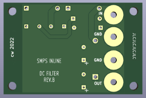

# SMPS Inline Filter with M3 holes - YGL92S

 
Original version is from Mark Johnson, Thread at diyaudio.com:
https://www.diyaudio.com/community/threads/po89zb-an-inline-dc-filter-for-smps-wall-warts-preamps-hpa-korg-nutube-etc.354213/#post-6197841

## Contributing

**Please take care on which branch you're currently working!**

Branches:

- *master* - this branch always holds the latest released revision
- *develop* - this is the develop branch with new features. Please base your patches on this branch.
